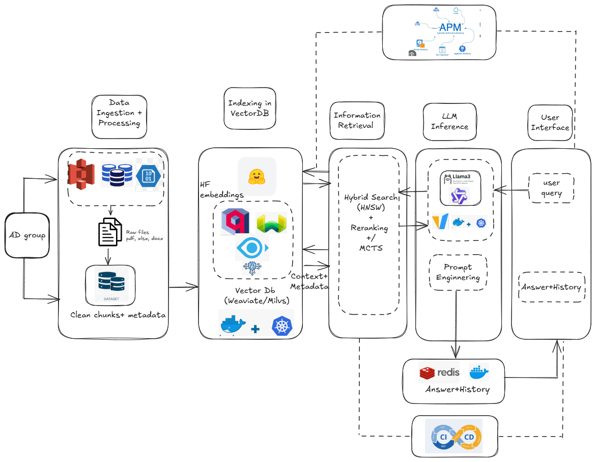

# Earnings Call RAG Chatbot

Query earnings call transcripts using RAG with streaming responses.

## Overview

- Hybrid search with Qdrant (dense + sparse embeddings)
- Qwen 2.5 LLM via vLLM
- FastAPI with SSE streaming
- Streamlit UI with real-time chat
- Redis for conversation history

## Architecture



## Features

- Multi-user support with document filtering
- Hybrid search (RRF fusion)
- Conversation history via Redis
- Source attribution with metadata
- Real-time streaming responses
- Query expansion for better retrieval


## Setup

### Prerequisites

- Python 3.8+
- Redis server
- Qdrant server
- vLLM server with Qwen model

### Installation

1. **Clone the repository**
   ```bash
   cd quantify_assesment
   ```

2. **Create virtual environment**
   ```bash
   python -m venv myenv
   source myenv/bin/activate  # On Windows: myenv\Scripts\activate
   ```

3. **Install dependencies**
   ```bash
   pip install fastapi uvicorn streamlit qdrant-client redis sentence-transformers pyyaml pydantic requests
   ```

4. **Start required services**
   
   **Qdrant:**
   ```bash
   docker run -p 6333:6333 qdrant/qdrant
   ```
   
   **Redis:**
   ```bash
   docker run -p 6379:6379 redis:latest
   ```
   
   **vLLM Server** (with Qwen model):
   ```bash
   vllm serve Qwen/Qwen2.5-0.5B-Instruct --port 8001
   # Or use ngrok for remote access
   ```

5. **Index documents** (first-time setup)
   ```bash
   cd src
   python data_indexing.py
   ```

## Usage

### Start the FastAPI Backend

```bash
cd src
uvicorn app_streaming:app --host 0.0.0.0 --port 8000 --reload
```

API will be available at: `http://localhost:8000`

### Start the Streamlit UI

```bash
cd src
streamlit run streaming_streamlit_app.py
```

Web interface will open at: `http://localhost:8501`

### API Usage

**Endpoint:** `POST /chat/`

**Parameters:**
- `user_id`: User identifier (e.g., "alice")
- `user_query`: Question about earnings calls

**Response:** Server-Sent Events (SSE) stream

**Event Types:**
1. **metadata** - Expanded queries and retrieved sources
2. **token** - Individual response tokens (streaming)
3. **done** - Final complete answer with metadata

**Example:**
```bash
curl -X POST "http://localhost:8000/chat/?user_id=alice&user_query=What%20is%20Amazon%20Q3%20report" \
  -H "Accept: text/event-stream"
```

### Using the Streamlit Interface

1. Open `http://localhost:8501`
2. Login with user ID (e.g., `alice`)
3. Ask questions about earnings calls
4. Watch responses stream in real-time
5. View source citations

## Models

- **Dense**: all-MiniLM-L6-v2
- **Sparse**: Splade_PP_en_v1
- **LLM**: Qwen 2.5 (0.5B) via vLLM

## Adding Documents

1. Place PDFs in `dataset/`
2. Update `pdf_mapping` in `config.yaml`
3. Run: `python src/data_indexing.py`

## Troubleshooting

- **Qdrant**: Check if running on `localhost:6333`
- **Redis**: Check if running on `localhost:6379`
- **vLLM**: Verify server is running and `config.yaml` has correct URL
- **No results**: Ensure docs are indexed and user_id matches config

## License

MIT
